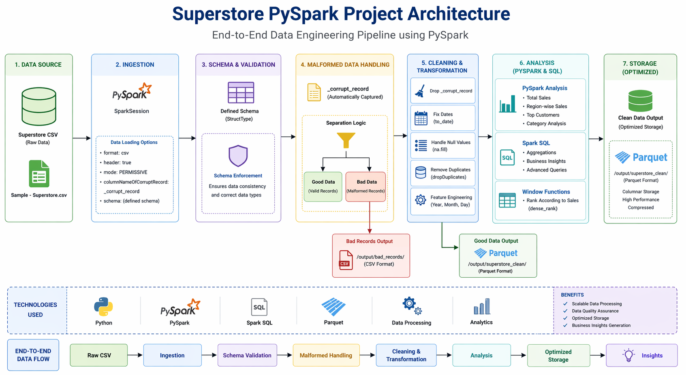

# 🛒 Superstore PySpark Data Engineering Project

---

## 📌 Overview

This project demonstrates an end-to-end data engineering pipeline using PySpark on the Superstore dataset.

It focuses on solving real-world data problems such as handling malformed data, cleaning inconsistent records, performing transformations, and generating business insights.

---

## 🏗️ Architecture

---

## 🚀 Project Workflow

Raw CSV Data → Schema Enforcement → Malformed Data Handling → Data Cleaning → Transformation → Analysis → Storage

---

## ⚙️ Tech Stack

PySpark  
Python  
Spark SQL  
Parquet  

---

## 🔥 Key Features

### Data Ingestion
Loaded raw CSV data using PySpark and initialized SparkSession for distributed processing.

---

### Schema Enforcement
Defined a structured schema to ensure correct data types and avoid inconsistencies during processing.

---

### Malformed Data Handling
Used a permissive data loading approach to automatically capture corrupted records.  
Separated valid data and invalid data to maintain data quality.

---

### Data Cleaning
Removed corrupted record columns, handled missing values, and eliminated duplicate records to ensure clean data.

---

### Date Transformation
Converted string-based date columns into proper date format for accurate analysis.

---

### Feature Engineering
Extracted useful features such as Year, Month, and Day from order dates to enable time-based analysis.

---

### Data Analysis
Performed key business analysis including:
- Total Sales calculation  
- Region-wise Sales analysis  
- Top Customers identification  
- Category-wise performance  

---

### Spark SQL
Used SQL queries on temporary views to perform structured and efficient data analysis.

---

### Advanced Analytics
Applied window functions to rank sales within each category for deeper insights.

---

### Data Storage
Stored cleaned data in optimized Parquet format for high performance.  
Saved malformed records separately in CSV format for auditing.

---

## 📊 Key Insights

- West region generates the highest sales  
- A small number of customers contribute significantly to revenue  
- Technology category performs the best  

---

## 📂 Project Structure

data → Raw dataset  
notebooks → Development and testing  
src → Modular pipeline code  
output → Processed data (clean + bad records)  

---

## ▶️ How to Run

Install required dependencies and run the main pipeline script to process the data and generate outputs.

---

## 💼 Resume Highlights

- Built an end-to-end PySpark data pipeline  
- Implemented schema validation and malformed data handling  
- Performed large-scale data transformations and analysis  
- Used Spark SQL and window functions  
- Optimized storage using Parquet format  

---

## 🔮 Future Enhancements

- Integration with Delta Lake  
- Dashboard creation using Power BI  
- Pipeline automation using Airflow  

---

## ⭐ Support

If you found this project useful, consider giving it a star!
